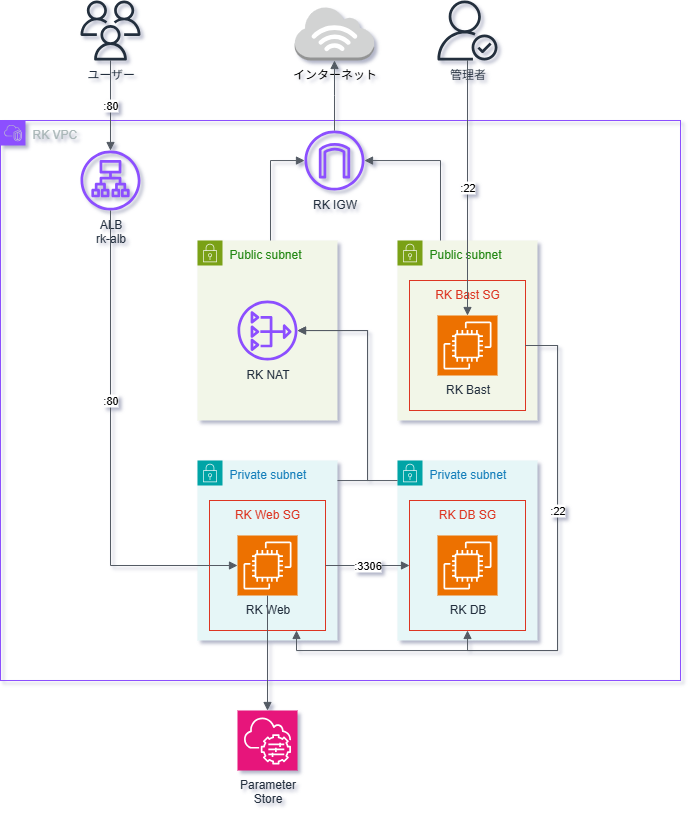

# シンプルなCRUDウェブアプリ

AWS課題

## インフラ図


## セットアップ
WebとDBのインスタンスでこのレポジトリをclone
```
git clone https://github.com/shika-n/yosida-simple-crud
cd yosida-simple-crud
```

### Webのセットアップ
#### AWSのアクセスキー
AWSのSSM (Parameter Store)を使うので`~/.aws/credentials`のファイルが必要

### データベースのセットアップ
#### データベースのユーザー設定
`docker-compose.yml`に2つの環境関数があって`MYSQL_USER`と`MYSQL_PASSWORD`

その2つの環境を設定し[DB実行](#DB)のセクションに続いてください

一回実行したら、その2つの関数の値を消しても大丈夫です。

データベースのデータは`dbdata`のフォルダーにあります。

#### データシード
ダミーデータが3つ入ってます。`dbSeed.sql`ファイルの中身を確認してください。

## ビルド
Webのインスタンスでウェブアプリのコンテナーをビルド
```
docker compose build web
```

## 実行
### Web
Webのインスタンスで
```
docker compose up web -d
```

### DB
DBのインスタンスで
```
docker compose up mysql -d
```
